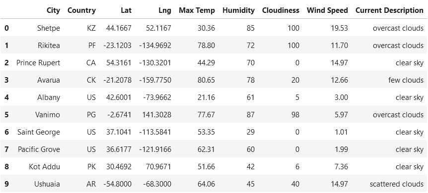
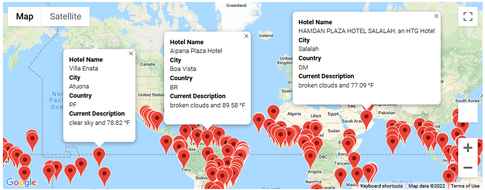
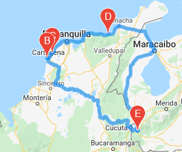
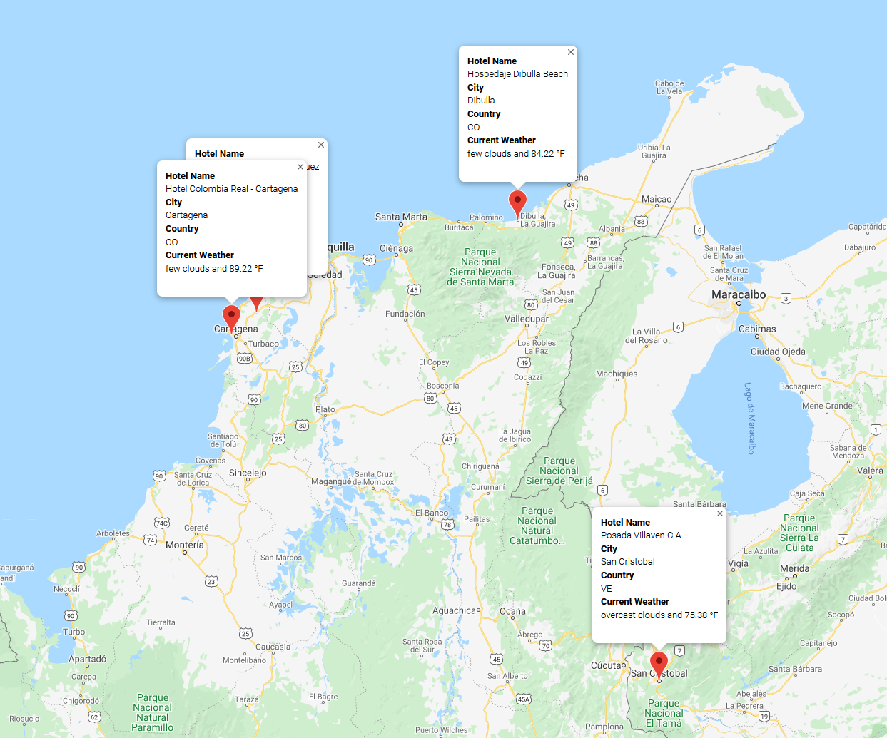

# World_Weather_Analysis

## Overview
This project is provide travel options based on desired temperature and weather.

## Purpose
The purpose of this project is to identify travel locations, analyze the local weather and provide travel options based on local temperature. Then provide hotel information for the travel areas of interest.

## Weather Analysis
By generating a random set of longitude and lattitude pairs we're able to collect city names, then build a dataset that includes their coordinates, city name, country, temperature, hunidity, cloudiness, wind speed and current weather conditions.

## Travel Search Options
By providing the user the opportunity to enter the desired temperature range for a travel destination we're able to map out the travel locations that fit this criteria.

## Detailed travel information
Once the user selects a destination region, we're able to provide travel directions

as well as City and Hotel details

## Summary
By incorporating data available through API's we're able to analyze weather around the world and provide travel destination recommendations based on the desired climate requirements of the Traveler.
